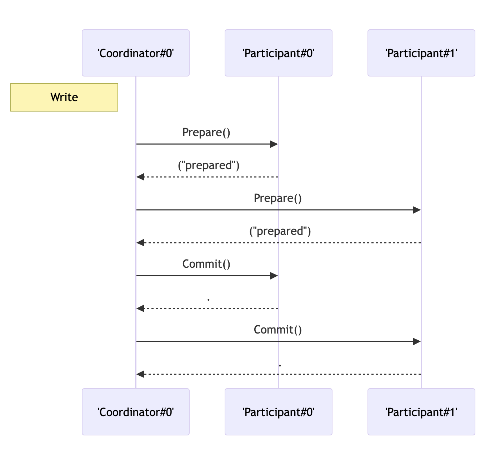
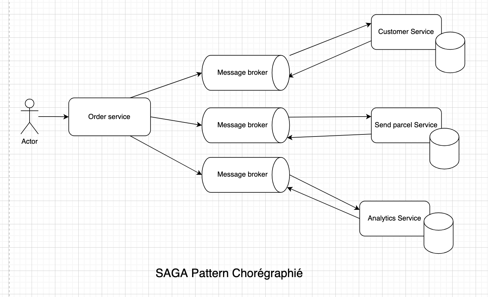
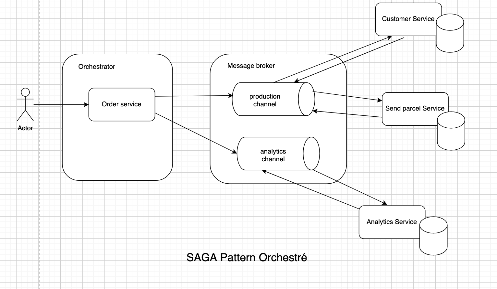

# Transactions distribuées

## Transaction

Une transcation est une **unité de travail qui doit être traitée de manière atomique**. Cependant, elle peut impliquer
**plusieurs opérations sur une ou plusieurs resources** (base de données, messages brokers, etc).

#### ACID

Les transactions doivent respecter les principes d'atomicité, de cohérence, d'isolation et de durabilité (ACID).

- Atomicité : Toutes les opérations réussissent ou aucune opération ne réussit.
- Cohérence : Les données passent d'un état valide à un autre état valide.
- Isolation : Les transactions concurrentes donnent les mêmes résultats que les transactions séquentielles.
- Durabilité : Les changements persistent après leur validation, même en cas de défaillance.

## Qu'est-ce qu'une transaction distribuée ?

Une transaction distribuée est une transaction qui **implique plusieurs resources** (base de données, messages brokers, etc)
et peut être répartie sur **plusieurs machines.**

Example d'un cas de paiement en ligne:

1. L'utilisateur ajoute un produit à son panier
2. L'utilisateur passe à la caisse
3. Le système vérifie la disponibilité du produit
4. Le système vérifie les informations de paiement au près de la banque
5. Le système réserve le produit (gestion de stock)
6. Le système débite le compte de l'utilisateur
7. Lancement du processus de livraison
8. Le système confirme la commande (mail / sms)

## 2 Phase Commit (2PC)

2PC est un protocole de **coordination de transactions distribuées** qui permet à plusieurs ressources de participer à
une
transaction. Les deux phases sont **le vote** (commit-request) et **le commit**. En se basant sur le consensus des
participants (vote) au commit et si la transaction n'est pas abandonnée (abort), le coordinateur decide le commit.

## SAGA

### Problèmes

Dans un système d'informations implémenté comme un micro-services, il est impossible de mettre en place 2PC, car les
services sont indépendants et qu'il est bloquant, ACID n'est pas garanti.

### Solution - SAGA

SAGA permet de garantir la cohérence d'une transcation distribuées en utilisant **une série de transactions locales**.
Chaque transaction locales met à jour la base de données (update) et envoie un message (ou event) pour déclencher la
transaction locale suivant. Si une transcation échoue, une série de transactions compensatoires (rollback) sont
déclenchées pour annuler les effets sur le système.

### Implémentation

#### SAGA chorégraphié

Chaque transaction publie un événement pour déclencher la suivante.

https://microservices.io/patterns/data/saga.html#example-choreography-based-saga

#### SAGA orchestré

Un orchestrateur centralisé est responsable de déclencher les transactions locales aussi bien fonctionnelles qui celles
qui échouent.

https://microservices.io/patterns/data/saga.html#example-orchestration-based-saga

#### Avantages

- La cohérence du système sur plusieurs machines est garantie sans faire de transaction distribuée.
- Non bloquant, les transactions locales sont indépendantes les unes des autres.

#### Inconvénients

- Pas de rollback automatique
- Le I d'ACID n'est pas garanti, il est possible d'avoir des données incohérentes pendant un certain temps (eventual
  consistency).
- L'implementation d'Event Sourcing est souvent nécessaire.

## Sources

### 2PC

- htps://en.wikipedia.org/wiki/Two-phase_commit_protocol

### SAGA

- https://learn.microsoft.com/en-us/azure/architecture/patterns/saga
- https://microservices.io/patterns/data/saga.html
