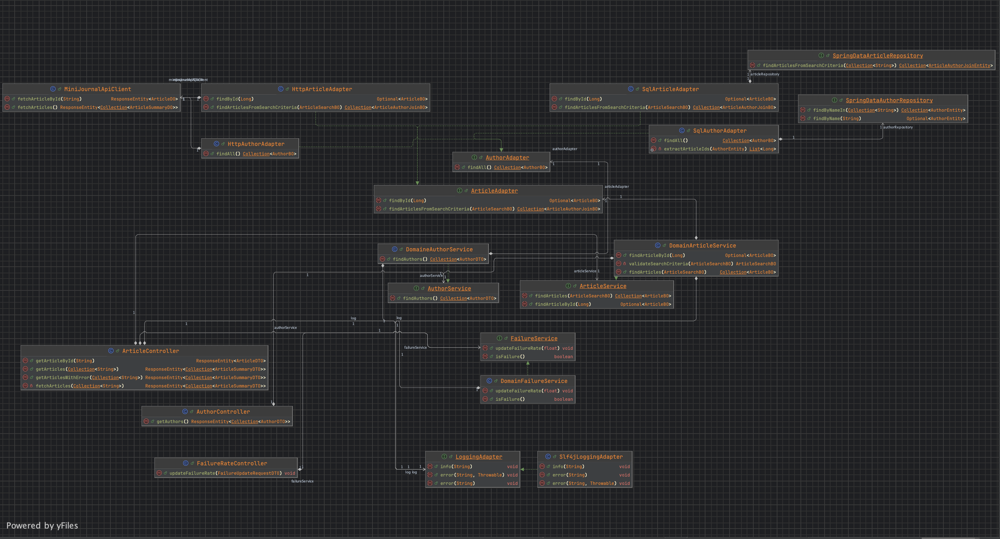

# Architecture hexagonale

## DDD

Domain-Driven Design (DDD) est une approche de conception logicielle qui met l'accent sur la modélisation du domaine.

## Architecture

L'architecture hexagonale, aussi connue sous le nom de Ports and Adapters, est un style d'architecture logicielle qui
vise à créer des applications découplées et facilement testables. Elle a été introduite par Alistair Cockburn dans les
années 2000.

Elle vise à limiter les fuites de dépendances entres les différentes couches d'une application en isolant le domaine
métier des détails techniques comme les bases de données, les interfaces utilisateur, ou les services externes.

### Principes clés

Le code métier ne doit dépendre d'aucune technologie, framework spécifique dans son implémentation. S'il a besoin de
communiquer avec l'extérieur, il doit le faire derrière un contrat d'interface qu'il définit. Dans notre exemple de
Minijournal, il faut enlever Spring de TOUS le package `domain`. En faisant cela, on découple le code métier des détails
techniques, il devient plus facile de pouvoir enlever Spring si jamais ! Le code métier devient également mieux
testable. En effet, plus besoin d'avoir Spring pour tester le code métier.

Les `Ports` représentent les points d'entrée pour que le monde communique avec notre application. Par exemple les
endpoints HTTP, ou bien GRPC, protobuf.

Les `Adapters` sont les points dédiés pour la partie métier pour accéder au monde extérieur. Par exemple les requêtes
SQL, ou bien HTTP.

`Ports` et `Adapters` n'ont pas le droit de se connaître ou de dépendre entre eux. C'est à l'application de faire le
lien si besoin.

### Implementation dans Minijournal

Dans le module [minijournal-api-ddd](../../j2e/cours/assets/minijournal/minijournal-api-ddd),
on peut étudier la différence entre une architecture ddd
et [non-ddd](../../j2e/cours/assets/minijournal/minijournal-api-ddd).

L'isolation du code métier du code d'infrastructure a été réalisé à l'aide d'`Adapter`. En utilisant ce pattern, il est
possible de ne pas contaminer le code métier avec Spring ici, ou bien n'importe quelle autre librairie ou framework.

### Avantages

- La logique métier est complètement isolée. Il est facile de le comprendre. Tous appels à une librairie extérieure ou
  framework est cachée derrière une
  abstraction.
- Les différentes layers (domain, infrastructure, application) sont clairement définis. Les contrats d'interfaces
  définissent le "data flow" (Qui ? Quoi? Pourquoi?) et les implémentations (Comment?) la partie infrastructure.
- Les tests de la partie métier sont beaucoup plus simples. En effet, il n'est pas nécessaire de configurer (spring
  ici), l'utilisation d'implémentation est naturelle (limitant les mocks complexes). Cela permet de pouvoir plus
  facilement les lancer, les maintenir et les réutiliser en cas de migration. Démo client, développement local
  facilité !
- Échanger les parties infra devient très facile, changer de SQL vers HTTP revient à implémenter un nouvel `Adapter`
  pour le besoin. Utile pour des changements externes (e.g: de technologies, de version d'API).
- Les migrations incrémentales sont possibles en ajoutant ou enlevant des `Ports` / `Adapters`.
- Dans la théorie (pas de changements de langage), l'architecture hexagonale permet d'éviter des récritures complètes
  des applications.

### Inconvénients, critique et dans le monde réel

- Verbeux, ajout de complexité pour les néophytes.
- Le principe d'ajouter des patterns `Mapper`s (conversion DTO -> BO, BO -> DO, etc) peut introduit beaucoup de
  boilerplate entraînant du temps de développement voire de complexité.
- Si l'architecture est faite à moitié, il y a peu de bénéfice !
- Certaines librarie très flexible OpenTelemetry, Spring, lombok (souvent basées autour des annontations) deviennent
  plus difficile à implémenter ! Nous restons des ingénieurs et il faut choisir quand sur qui comment implémenter les
  outils à notre disposition !
- La scalabilité horizontale est quasiment impossible 
- L'utilisation des bases de données se retrouve réduit, ce qui peu amener des problèmes de performance

## Sources

- https://en.wikipedia.org/wiki/Hexagonal_architecture_(software)
- https://dataintensive.net/
- https://www.amazon.com/Clean-Architecture-Craftsmans-Software-Structure/dp/0134494164
- https://www.baeldung.com/hexagonal-architecture-ddd-spring
- https://ivan.canet.dev/blog/2024/08/01/hexagonal-architecture.html#hexagonal-architecture

Pour aller plus loin !

- https://binout.github.io/#_%EF%B8%8F_jugsummercamp_september_2017
- https://binout.github.io/ten-tips-gs-ddd/#_pourquoi_ddd
