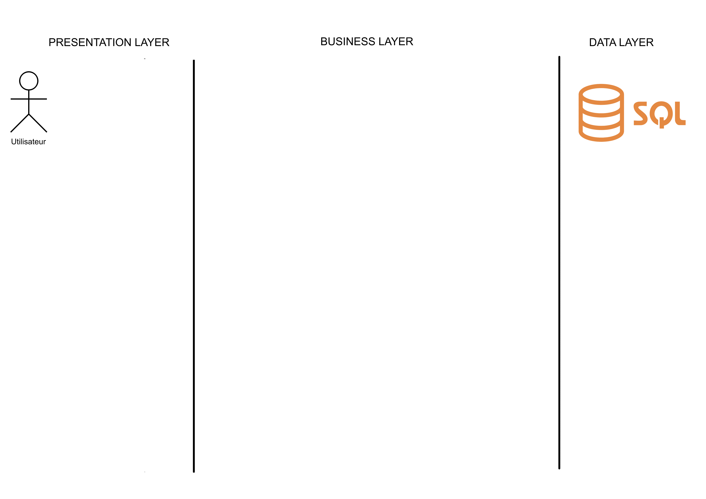
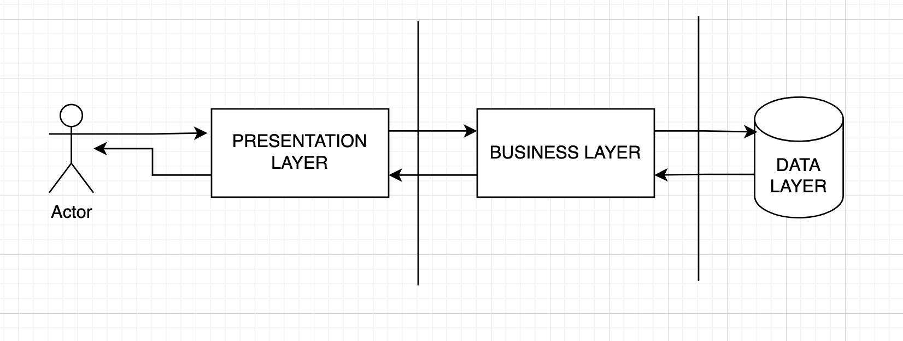
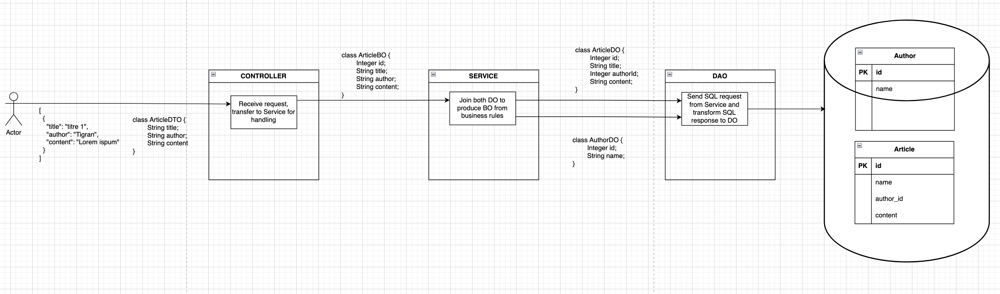

# Multi-tiers architecture

En ingénierie du logiciel, les développeurs essayent d'utiliser des standards, des patrons et éléments facilement
reconnaissables. Avec l'essor de la conception objet, beaucoup d'architectures sont couplées à celui-ci. Dans ce cours,
nous nous intéresserons seulement aux architectures liées aux objets.

L'architecture multi-tiers (ou n-tier) est dites client-serveur. On sépare physiquement en plusieurs couches
l'application. Le terme de 3-Tier est souvent utilisé, car les architectures autour du web sont souvent composées de
trois couches.

### Les couches populaires

Les couches populaires au sein des systèmes d'informations sont les suivantes:

#### Présentation

Cette couche correspond à l'interface utilisateur (UI). Elle peut être l'utilisateur final avec souvent une UI
simplifiée (applications) ou alors simplement un contrat entre deux entités, souvent le JSON.

#### Application / Business

C'est la couche qui représente un besoin utilisateur. Elle transforme la donnée brute de la couche de données en une
version répondant à une règle métier du monde "réel". Elle est là pour nous rappeler que l'informatique reste
un outil pour résoudre une problématique. On utilise généralement dans cette couche un ORM afin de lier, en effectuant
un mapping, notre modèle à notre code objet facilement. Cette couche s'occupe également de gérer les erreurs, elle est
capable d'appliquer la règle métier et donc d'infirmer certaine requêtes.

#### Data

Le Data Layer ou couche de données est notre donnée physique. Elle peut être une base de données (SQL, GraphQL), une API
REST.

Les couches sont dépendantes de celle sur laquelle elle est construite.

## Exercice:

Voici un schéma vierge représentant trois couches (Presentation, Business et Data). Nous souhaitons réaliser
l'architecture d'un journal (comme Le Monde, La Voix du Nord). Représentez le schéma SQL, les payloads échangés entre
les couches.

Réponse possible de l'exercice

## Avantages

- Mise à l'échelle (caching, changement de modèle).
- La résilience (un seul composant est impacté en cas de panne).
- La sécurité (authorization, authentication, logging) dans le cas d'applications web.

## Inconvénients

- Maintenance et latence s'accroissent avec le nombre de couches.
- Monitoring et logging peuvent être coûteux et complexe à mettre en place.
- Ajouter un cache, pour réduire la latence, introduit un état supplémentaire dans l'application.

## Quand l'utiliser ?

Si votre application est appelée à s'agrandir et changer régulièrement de specs. L'architecture n-tier est utilisée
sur le web avec des applications web. Le front joue le rôle de présentation, l'API REST est la partie business et la
source de donnée (SGBD ou autre API REST).

Il convient également à des applications de bureaux en adaptant les différentes couches.

## Sources:

- [Wikipédia](https://en.wikipedia.org/wiki/Multitier_architecture)
- [Microsoft Azure guide lines](https://learn.microsoft.com/en-us/azure/architecture/guide/architecture-styles/n-tier)
- Le livre [Designing Data Intensive Application](https://dataintensive.net/)
