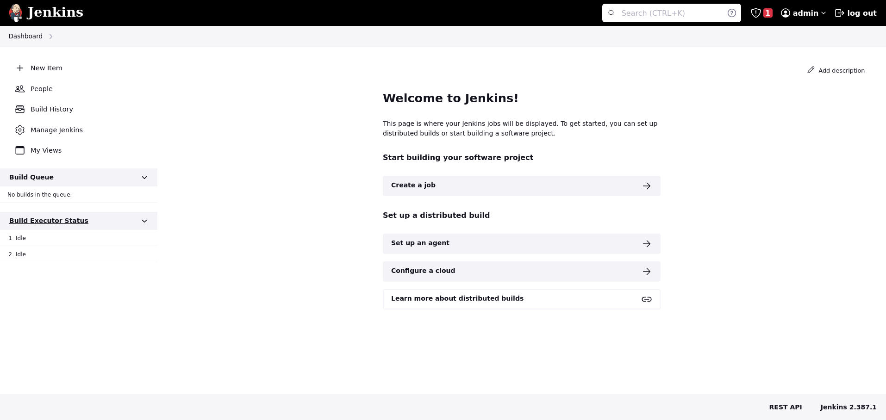

# Intégration continue avec Jenkins

Jenkins est un outil de que vous allez rencontrer pendant votre carrière. Il permet d'automatiser les builds et le
deploiement de nos applications.

Nous allons suivre les documentations suivantes afin d'installer jenkins:

- [Jenkins documentation](https://www.jenkins.io/doc/book/installing/docker/)
- [Hello world](https://www.jenkins.io/doc/pipeline/tour/hello-world/)

Vous pouvez utiliser le docker compose dans le [repo](https://github.com/rolf1e/rolf1e.github.io).
En modifiant le chemin de jenkins_home vers un chemin aproprié, vous devriez pouvoir executer `docker compose up`.
Remplissez ensuite les champs nécessaires à la création d'un utilisateur jenkins.

Vous obtenez ensuite 