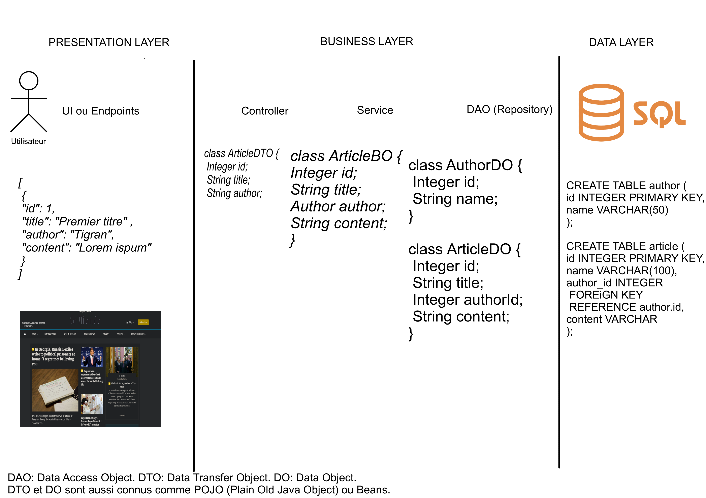

# Multi-tiers architecture

En ingénierie du logiciel, les développeurs essayent d'utiliser des standards, des patrons et éléments facilement
reconnaissables. Avec l'essor de la conception objet, beaucoup d'architectures sont couplées à celui-ci. Dans ce cours,
on
s'intéressera seulement à celles-ci.

L'architecture multi-tiers (ou n-tier) est dites client-serveur dans laquelle on sépare physiquement en
plusieurs couches la présentation, la transformation et le stockage de la donnée. Le plus couramment on utilise le
3-tier.

### Les couches populaires

Les couches populaires au sien des systèmes d'informations sont les suivantes:

#### Presentation

Il correspond à l'interface utilisateur (UI). Il peut être l'utilisateur final avec souvent une UI simplifiée
(applications) ou alors simplement un contrat entre deux entités, souvent le JSON.

#### Application / Business

C'est la couche qui représente un besoin utilisateur. Elle transforme la donnée brute de la couche de données en une
version qui nous répondant à une règle métier du monde "réel". Elle est là pour nous rappeler que l'informatique reste
un outil pour résoudre une problématique. On utilise généralement dans cette couche un ORM afin de lier, en effectuant
un mapping, notre modèle à notre code objet facilement.

#### Data

Le Data Layer ou couche de données est notre donnée physique. Elle peut être une base de données (SQL, GraphQL), une API
REST.

Les couches sont dépendantes de celle sur laquelle elle est construite.

## Exercice:

Voici un schéma vierge représentant trois couches (Presentation, Business et Data). Nous souhaitons réaliser
l'architecture d'un journal (comme Le Monde, La Voix du Nord). Représenter le schéma SQL, les payloads échangés entre
les couches.

Réponse possible de l'exercice

## Avantage

- Mise à l'échelle (caching, changement de modèle)
- La résilience (un seul composant est impacté en cas de panne)
- La sécurité (authorization, authentication, logging) dans le cas d'applications web.

## Inconvénient

Plus il y a de couches, plus il devient difficile de les maintenir, savoir ce qu'il se passe avec du monitoring et du
logging est une solution, mais cela peut devenir coûteux et complexe à mettre en place. La latence s'accentue à chaque
nouvelle couche. L'utilisation de "cache" devient nécessaire, mais introduit un état supplémentaire dans l'application.

## Quand l'utiliser ?

Si votre application va être appelée à s'agrandir et changer régulièrement de specs. Il est utilisé sur le web avec des
applications web. Le front joue le rôle de présentation, l'API REST est la partie business et la source de
donnée (SGBD ou autre API REST).

Il convient également à des applications de bureaux en adaptant les différentes couches.

## Sources:

https://en.wikipedia.org/wiki/Multitier_architecture
https://learn.microsoft.com/en-us/azure/architecture/guide/architecture-styles/n-tier
https://dataintensive.net/