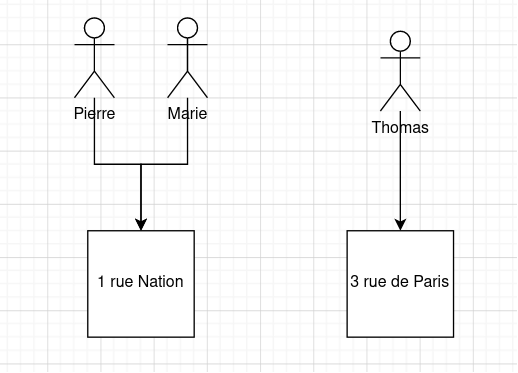

## Sommaire

- Spring
- Spring Boot
- REST
- Security
- DATA

## Spring

[Spring](https://spring.io/projects/spring-framework) est un framework Java pour construire des applications variées.
Spring est une implémentation de [Jakarta EE](https://jakarta.ee/). Des alternatives comme Jetty, Tomcat.

Il facilite des tâches en Java comme le support pour le web, l'accès à la donnée via son ORM, l'envoie d'emails, de SMS,
le scheduling, le caching en
[s'intégrant](https://docs.spring.io/spring-framework/docs/current/reference/html/integration.html) facilement.
Il possède également un support pour le langage Kotlin.

Spring est composé de plusieurs petites briques appelées modules ou "containers".

- Spring core: IoC, i18n, Data Binding, ...
- Spring tests: Mocks, TestContext, ...
- Data access: Transactions, ORM, ...
- Web Servlet: MVC, WebSockets, STOMP, ...
- Integration: REST, Scheduling, Caching, ...

### Dependency Injection (DI)

[L'Injection de Dépendance](https://en.wikipedia.org/wiki/Dependency_injection) est un patron de conception dans lequel
un objet ou une fonction reçoit ses dépendances en paramètre. Ce patron à pour intérêt de mettre en évidence les
dépendances externes. Les objets deviennent moins couplés. En effet, il est plus simple de les remplacer par leurs
interfaces.

```java
public interface Hat {
}

public class Casquette extends Hat {
}

public class HautDeFormes extends Hat {
}

public class Person {
    private String name;
    private Hat hat;

    public Person(Hat hat) {
        this.name = "A name";
        this.hat = hat;
    }

    public Person(String name,
                  Hat hat) {
        this.name = name;
        this.hat = hat;
    }

    public static void main(String[] args) {
        var pierre = new Person(new Casquette());
        var marie = new Person(new HautDeFormes());
    }
}
```

### Inversion of Control (IoC)

[L'Inversion de Contrôle](https://en.wikipedia.org/wiki/Inversion_of_control) est un autre patron proche de l'Injection
de Dépendance, mais qui va plus loin en automatisant la manière dont les dépendances sont transmises aux objets. En
effet, même si l'DI est efficace pour réduire les effets de bords, en java spécialement, le code devient
particulièrement lourd avec beaucoup code boilerplate à rédiger afin de passer et construire les différentes
dépendances.

## Spring Boot 2.7.0

Spring boot est un projet permettant de démarrer facilement une application Spring. Il s'occupe seule de lancer le
Contexte, les Beans via l'IoC, initier les connexions aux bases de données, mettre à l'écoute les différents endpoints
si besoin.

Ce morceau de code est a placé à la racine de votre projet, c'est notre super application utilisant Spring Boot !

```java

@SpringBootApplication
class MySpringApplication {
    public static void main(String[] args) {
        SpringApplication.run(MySpringApplication.class, args);
    }
}
```

Cette annotation `@SpringBootApplication` fait les choses suivantes:

- `@Configuration`: Tag la classe comme source de définition pour les `@Bean`s pour le Context.
- `@EnableAutoConfiguration`: Dis à Spring Boot de commencer à ajouter les `Bean`s en fonctions des paramètres du
  classpath, d'autres `@Bean`s et des `properties`.
- `@ComponentScan`: Dis à Spring de chercher les `@Component`s, `@Configuration`s, `@Service`s, `@Controller`s
  et `@Repository`s dans le package courant.

### Le Context et ses @Configuration et ses @Bean

Afin de mettre en place ces deux patrons, Spring utilise des notions comme le Context. Le Context de Spring pour se
résumer comme le cycle de vie d'une application. Il est défini par les différents `@Bean`s qui y vivent.

Un `@Bean` est une instance de classe créée par Spring qui va être injectée sur demande à d'autres `@Bean`s. Ils sont
déclarés dans une classe de configuration annotée de `@Configuration`.

```java
public class HatDealer {
    public Hat dealAHat() {
        // return a random hat
    }
}

@Configuration
public class HelloWorldConfig {
    @Bean
    public HatDealer hatDealer() {
        return new HatDealer();
    }
}

@Component
public class PersonFactory {
    private HatDealer hatDealer;

    public PersonFactory(HatDealer hatDealer) {
        this.hatDealer = hatDealer;
    }

    public Person newPerson(String name) {
        return new Person(name, hatDealer.dealAHat());
    }
}
```

Par défaut Spring utilise le typage pour résoudre l'injection. Mais il est possible de rencontrer des cas ambigus où
deux `@Bean`s de même type doivent vivre ensemble. On peut alors utiliser `@Qualifier` pour nommer notre `@Bean`.

### Les paramètres

Vous êtes peut-être habitué à avoir un fichier `.env` ou bien une config `.json`. Java, spécifiquement Maven, a pris une
autre route avec `.properties` ou plus récemment `.yml`. Dans les dernières versions de Spring, il est possible de
rajouter un fichier `application.yml` dans le dossier `resources`.

## Spring DATA

### Hibernate

[Hibernate](https://hibernate.org/) est un ORM mais aussi une suite d'outils interagissant avec la donnée.

Un Object Relational Mapping est une technique de programmation convertissant le système de type d'un langage en
utilisant la programmation orientée objet. Cela évite de devoir maintenir la transformation SQL -> Java, de maintenir
des requêtes avec des `String` magiques. Certain vont plus loin avec des fonctionnalités pour la gestion du modèle de
données (schéma, migration).

Hibernate est aussi implémentation de l'API Java de persistance (JEE).

### Spring DATA API, l'ORM

#### Setup une connexion à une base de données

##### Driver

Nous allons réaliser l'installation et la configuration d'Hibernate à travers Spring.
Rajouter dans votre `pom.xml` les dépendances suivantes:

```xml

<dependencies>
    <dependency>
        <groupId>org.springframework.boot</groupId>
        <artifactId>spring-boot-starter-data-jpa</artifactId>
        <version>${spring.version}</version>
    </dependency>

    <!-- SQL DRIVER -->
    <dependency>
        <groupId>org.postgresql</groupId>
        <artifactId>postgresql</artifactId>
        <version>42.5.1</version>
    </dependency>
</dependencies>
```

##### Data Source

Configurons maintenant la data source (connexion à la base de données).

###### Avec Yaml

Dans notre fichier `application.yml`

```yaml
spring:
  datasource:
    url: // url de connexion jdbc
    username: ${USER}
    password: ${PASSWORD}
  jpa:
    show-sql: false
    hibernate:
      ddl-auto: none
      naming-startegy: org.hibernate.cfg.ImprovedNamingStrategy
      dialect: // Dialect lié à notre base de données
```

###### Avec du Java

Dans une classe de configuration par exemple `DataSourceConfig`, ajouter le `@Bean`. Cette méthode est pratique car,
elle permet de gérer plusieurs data source en même temps facilement avec un bon nommage de `@Bean`s.

```java

@Configuration
public class DataSourceConfig {
    @Bean
    public DataSource getDataSource() {
        return DataSourceBuilder.create()
                .driverClassName("// driver")
                .url("// jdbc url")
                .username("")
                .password("")
                .build();
    }
}
```

- [Configurer une data source avec Java](https://www.baeldung.com/spring-boot-configure-data-source-programmatic)
- [Multiple DataSource configuration](https://www.baeldung.com/spring-boot-configure-multiple-datasources)

#### @Entity - POJO / DO

D'abord, il nous faut une classe (POJO / DO) représentant notre schéma SQL.

```java

@Entity
@Table(name = "person")
@Setter
@Getter
@NoArgConstructor
public class PersonEntity {

    @Id
    @GeneratedValue(strategy = GenerationType.AUTO)
    private Long id;

    @Column(name = "name")
    private String name;

    @Column(name = "age")
    private Integer age;

    // Modification fields
    @Basic
    @Column(name = "created_at", updatable = false, columnDefinition = "timestamp default current_timestamp")
    private LocalDateTime createdAt;

    @Basic
    @Column(name = "updated_at", columnDefinition = "timestamp default current_timestamp")
    private LocalDateTime updatedAt;
}
```

#### @Repository - DAO

Il faut maintenant un moyen d'accéder à notre donnée, cela s'appelle un DAO.

Avec Spring, il faut faire créer une interface implémentant
soit [`JpaRepository`](https://docs.spring.io/spring-data/jpa/docs/current/api/org/springframework/data/jpa/repository/JpaRepository.html)
ou
bien  [`CrudRepository`](https://docs.spring.io/spring-data/commons/docs/current/api/org/springframework/data/repository/CrudRepository.html)
ces interfaces acceptent deux paramètres `T` et `ID`. Le premier est notre entité, le deuxième est le type de la clé
primaire.

```java

@Repository
public interface PersonRepository extends JpaRepository<PersonEntity, Integer> {
}
```

Notre DAO peut maintenant accéder des méthodes comme `count()`, `save(S entity)`, `find*()`.

Il est possible de définir ces propres méthodes pour accéder notre donnée. Ces méthodes doivent cela dit respecter
certains critères dans leur signature.

- Le nommage
- Le type de retour
- Les paramètres

Cela permet de construire des queries en ne codant que du Java !

```java

@Repository
public interface PersonRepository extends JpaRepository<PersonEntity, Integer> {
    Optional<PersonEntity> findByName(String name);
}
```

[La spécification des repositories](https://docs.spring.io/spring-data/jpa/docs/current/reference/html/#repositories)

[Liste de tous les mots clés possible](https://docs.spring.io/spring-data/jpa/docs/current/reference/html/#appendix.query.method.subject)

Il est également possible d'utiliser l'annotation `@Query` afin de gérer les queries avec des `String`.

```java

@Repository
public interface PersonRepository extends JpaRepository<PersonEntity, Integer> {
    @Query("SELECT p FROM Person p WHERE p.age = :age")
    Collection<PersonEntity> findAllByAge(@Param("age") Integer age);
}
```

[Tutoriel pour @Query](https://www.baeldung.com/spring-data-jpa-query)

### Persistence

L'API nous permet également de persister notre données facilement. Nous pouvons utiliser notre repository pour cela.

```java

@Repository
public interface PersonRepository extends JpaRepository<PersonEntity, Integer> {
}

public class PersonService {
    private final PersonRepository personRepository;

    public void registerNewPerson(PeronEntity person) {
        personRepository.save(person);
    }

}
```

Ce morceau de code peut faire des choses très poussées car, en fonction des attributs de l'objet entité donné, l'API
effectuera soit un `INSERT` ou alors un `UPDATE`.

Ou alors en utilisant `@Query` et `@Modifying`, nous pouvons controller ce comportement.

```java

@Repository
public interface PersonRepository extends JpaRepository<PersonEntity, Integer> {

    @Modifying
    @Query("update Person p set p.age = :age where p.name = :name")
    int updateUserSetStatusForName(@Param("name") String name, @Param("age") Integer age);

}
```

### SQL Relations

#### Le mapping

Spring est également capable de gérer les relations SQL entre nos entités !!

Pour cela, il existe encore des supers annotations ! (Oui, encore !).

- `@OneToOne`
- `@OneToMany` et `@ManyToOne`
- `@ManyToMany`

On peut par exemple rajouter une adresse à notre personne.



```java

@Entity
@Table(name = "person")
@Setter
@Getter
@NoArgConstructor
public class AddressEntity {

    @Id
    @GeneratedValue(strategy = GenerationType.AUTO)
    private Long id;

    @Column(nullable = false)
    private String location;

    @OneToMany(mappedBy = "address")
    private Collection<PersonEntity> persons;

}

@Entity
@Table(name = "person")
@Setter
@Getter
@NoArgConstructor
public class PersonEntity {

    @Id
    @GeneratedValue(strategy = GenerationType.AUTO)
    private Long id;

    @Column(name = "name")
    private String name;

    @ManyToOne
    @Column(name = "address_id")
    private AddressEntity address;

}
```

L'avantage est que par la suite, nous sommes capable d'écrire du code comme suit

```java

public class AddressService {
    private AddressRepository addressRepository;
    private PersonRepository personRepository;

    public Collection<String> findPersonAtAddress(String address) {
        return this.addressRepository.findByName(address)
                .getPersons() // Collection<PersonEntity>
                .stream()
                .map(PersonEntity::getName)
                .collect(Collectors.toList());
    }

    public String findAddressOfPerson(String person) {
        return this.personRepository.findByName(person)
                .getAddress() // AddressEntity
                .getName();
    }
}
```

Nous effectuons des requêtes SQL en écrivant que du Java !

[Petit tutoriel](https://www.baeldung.com/spring-data-rest-relationships)

## Spring REST

### @Controller, notre endpoint

L'annotation `Controller` permet d'enregistrer en controller auprès de Spring. Il existe une spécification
`@RestController` qui déclarant un controller REST. L'annotation hérite de `@Component`. Elle accepte en paramètre une
chaîne de caractères qui définie une racine commune pour les routes que le controller contiendra.

Afin de définir un endpoint dans notre application, il faut utiliser les annotations suivantes.
`@Mapping`, `@GetMapping`, `@PostMapping`.

```java

@RestController("hello")
public class HelloWorldController {

    @GetMapping(value = "/world")
    public ResponseEntity<String> sayHello() {
        return ResponseEntity.ok("Hello World !");
    }
}
```

Bien qu'il soit possible de retourner directement un type sans passer
par [`ResponseEntity`](https://docs.spring.io/spring-framework/docs/current/javadoc-api/org/springframework/http/ResponseEntity.html),
il est bonne pratique d'utiliser ce dernier. En effet, pour la gestion d'erreur, il possède en API gérant
les [codes HTTP](https://developer.mozilla.org/en-US/docs/Web/HTTP/Status).

Java étant un langage avec un typage fort à la compilation, il nous permet de construire une API avec des messages
typés ! Un projet très connu de parsing en Java
s'appelle [Jackson](https://www.baeldung.com/jackson-object-mapper-tutorial). Il utilise les constructeurs et accesseurs
des objets pour pouvoir serializer (ou bien deserializer). Il propose ensuite tout un panel d'adaptateurs (JSON,
XML, ...). Il possède également une manière plus manuelle en utilisant un `ObjetMapper`.

### RestOperations et RestTemplate

Nativement, Java permet de faire des opérations sur le réseau à travers `HttpUrlConnection`. Spring ajoute au-dessus
cette API sa propre interprétation `RestOperations` et plus précisément `RestTemplate`. Son API est simple et permet la
deserialization autonome dans des `Class<T>` Java.

```java
public class PlayGround {
    public void http() {
        final var rest = new RestTemplateBuilder()
                .defaultHeader("Authorization", "Basic " + basicPayload);

        final var response = rest.getForEntity("http://localhost:8080/authors", String[].class);

    }
}
```

### Open API (Swagger)

Il est possible de générer un swagger avec Open API. Cela permet de facilement partager les specs de l'API avec d'autres
équipes.

```xml

<dependency>
    <groupId>org.springdoc</groupId>
    <artifactId>springdoc-openapi-ui</artifactId>
    <version>${spring.openapi.version}</version>
</dependency>
```

Vous pouvez configurer l'endroit où sera exposé le swagger avec ce paramètres.

```yml
springdoc:
  swagger-ui.path: /docs
```

En occurrence, ici : http://localhost:8080/docs

- [La documentation officielle](https://springdoc.org/v2/) il faut utiliser la version `/v2` pour une version `3.x.x` de
  Spring Boot.
- [Tutoriel Baeldung](https://www.baeldung.com/spring-rest-openapi-documentation)

## Spring Security

Spring possède une couche d'authentification. Grâce à SpringBoot, il n'y a quasiment rien à configurer !

[Documentation officielle](https://docs.spring.io/spring-security/reference/servlet/getting-started.html)

Il faut ajouter cette dépendance à notre pom.xml.

```xml
        <!-- SPRING SECURITY (REST) -->
<dependency>
    <groupId>org.springframework.security</groupId>
    <artifactId>spring-security-web</artifactId>
</dependency>
<dependency>
<groupId>org.springframework.security</groupId>
<artifactId>spring-security-config</artifactId>
</dependency>
```

En ajoutant ces deux lignes, si on relance l'application Spring, elle démarre avec le message suivant.


En essayant de retourner sur notre application, Spring nous demande de nous authentifier.
Vous pouvez utiliser l'utilisateur `user` et le mot de passe dans votre console.


Bien évidement, ce n'est pas un comportement que l'on souhaite en production !

Il est possible de
simplement [changer le mot de passe maître](https://www.baeldung.com/spring-boot-security-autoconfiguration).

### Basic Authentication

Spring permet en quelques méthodes de mettre en authentification simple avec Basic par exemple.

Il faut pour cela définir deux `Bean`s.

```java

@Configuration
@EnableWebSecurity
@RequiredArgsConstructor
public class SecurityConfig {
    @Bean
    public InMemoryUserDetailsManager userDetailsService(PasswordEncoder passwordEncoder) {
        UserDetails user = User.withUsername("user")
                .password(passwordEncoder.encode("password"))
                .roles("USER")
                .build();

        UserDetails admin = User.withUsername("admin")
                .password(passwordEncoder.encode("admin"))
                .roles("USER", "ADMIN")
                .build();

        return new InMemoryUserDetailsManager(user, admin);
    }

    @Bean
    public PasswordEncoder passwordEncoder() {
        return PasswordEncoderFactories.createDelegatingPasswordEncoder();
    }
}
```

Ce code déclare un store en mémoire contre lequel, on peut venir identifier nos requêtes HTTP. (à ne pas utiliser en
production bien évidement !).

```java

public class SecurityConfig {
    @Bean
    public SecurityFilterChain securityFilterChain(final HttpSecurity http) throws Exception {
        http.csrf()
                .disable()
                .authorizeHttpRequests()
                .anyRequest()
                .authenticated()
                .and()
                .httpBasic();
        return http.build();
    }
}
```

Cette deuxième méthode permet de modifier la sécurité de nos routes. JEE, et donc Spring, utilisent
une [chaîne de responsabilités](https://refactoring.guru/design-patterns/chain-of-responsibility)
appelée [Filter](https://jakarta.ee/specifications/servlet/5.0/apidocs/jakarta/servlet/filter)
et [SecurityFilterChain](https://docs.spring.io/spring-security/site/docs/3.1.4.RELEASE/reference/security-filter-chain.html).

Il ne faut pas oublier de désactiver la configuration
automatique `@SpringBootApplication(exclude = {SecurityAutoConfiguration.class })`.

Ici, les toutes routes seront protégées par basic en désactivant les CSRF.

### Filters

Il est possible de définir ses propres filtres pour effectuer des actions techniques, comme l'authentification, du
logging, monitoring, conversion etc.

Le `CorsFilter` de Spring est un bon exemple à étudier.

```java
class SecurityConfig {
    @Bean
    public CorsFilter corsFilter() {
        final var source = new UrlBasedCorsConfigurationSource();
        final var config = new CorsConfiguration();
        config.setAllowCredentials(true);
        config.setAllowedOriginPatterns(Collections.singletonList("*"));
        config.addExposedHeader("Authorization, x-xsrf-token, Access-Control-Allow-Headers, Origin, Accept, X-Requested-With, " +
                "Content-Type, Access-Control-Request-Method, Location");
        config.addAllowedHeader("*");
        config.addAllowedMethod("OPTIONS");
        config.addAllowedMethod("GET");
        config.addAllowedMethod("POST");
        config.addAllowedMethod("PUT");
        config.addAllowedMethod("DELETE");
        source.registerCorsConfiguration("/**", config);
        return new CorsFilter(source);
    }
}

```

Ici, il n'est pas utile de venir le placer dans la chaîne, mais si habituellement, il faut l'introduire vu la
variable `HttpSecurity http` avec la méthode `addFilterAfter(filter, Class<OtherFilter>)`

### SecurityContext

Spring met à disposition pendant toute la durée de la requête HTTP une variable essentielle: `SecurityContext`
accessible via `SecurityContextHolder`. Il est le moyen pour obtenir une variable de type `Authentification` qui
représente l'utilisateur. Il peut être populé, généralement au début de requête dans les `Filter`s.

```java
final var securityContext=SecurityContextHolder.getContext();
final var auth=securityContext.getAuthentication();
        log.info("Hello from {}, {}, {}",auth.getName(),auth.getDetails(),auth.getPrincipal());
```

#### Tooling

[Spring Initilizr](https://start.spring.io/) est un outil permettant de générer des projets spring.

Cet outil est inclus dans intellij à la création de votre projet :) .

### Mettre un peu d'ordre dans tout ça

Il est bon vivre que de ranger correctement ses affaires pour les retrouver. Spring n'échappe pas à cette règle.

Je vous propose l'organisation suivante pour vos futures applications Spring !

```
fr.ulco.demo
    - .controllers // Nos points d'entrée - sortie
    - .services // Notre code métier
    - .configurations // Pour nos @Configuration, @Bean
    - .model 
        - .dto 
        - .entities 
        - .dao // Nos @Repository
```

### Spring tests

### Caching avec Guava

### QueryBuilder, le dessous de la mécanique
