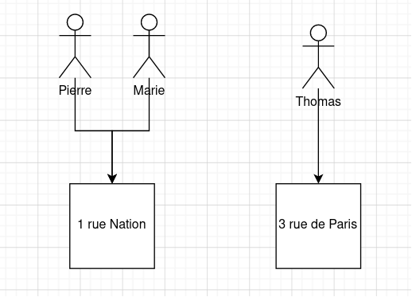

## Spring DATA

### Hibernate

[Hibernate](https://hibernate.org/) est un ORM mais aussi une suite d'outils interagissant avec la donnée.

Un Object Relational Mapping est une technique de programmation convertissant le système de type d'un langage en
utilisant la programmation orientée objet. Cela évite de devoir maintenir la transformation SQL -> Java, de maintenir
des requêtes avec des `String` magiques. Certain vont plus loin avec des fonctionnalités pour la gestion du modèle de
données (schéma, migration).

Hibernate est aussi implémentation de l'API Java de persistance (JEE).

### Spring DATA API, l'ORM

#### Setup une connexion à une base de données

##### Driver

Nous allons réaliser l'installation et la configuration d'Hibernate à travers Spring.
Rajouter dans votre `pom.xml` les dépendances suivantes:

```xml

<dependencies>
    <dependency>
        <groupId>org.springframework.boot</groupId>
        <artifactId>spring-boot-starter-data-jpa</artifactId>
        <version>${spring.version}</version>
    </dependency>

    <!-- SQL DRIVER -->
    <dependency>
        <groupId>org.postgresql</groupId>
        <artifactId>postgresql</artifactId>
        <version>42.5.1</version>
    </dependency>
</dependencies>
```

##### Data Source

Configurons maintenant la data source (connexion à la base de données).

###### Avec Yaml

Dans notre fichier `application.yml`

```yaml
spring:
  datasource:
    url: // url de connexion jdbc
    username: ${USER}
    password: ${PASSWORD}
  jpa:
    show-sql: false
    hibernate:
      ddl-auto: none
      naming-startegy: org.hibernate.cfg.ImprovedNamingStrategy
      dialect: // Dialect lié à notre base de données
```

###### Avec du Java

Dans une classe de configuration par exemple `DataSourceConfig`, ajouter le `@Bean`. Cette méthode est pratique car,
elle permet de gérer plusieurs data source en même temps facilement avec un bon nommage de `@Bean`s.

```java

@Configuration
public class DataSourceConfig {
    @Bean
    public DataSource getDataSource() {
        return DataSourceBuilder.create()
                .driverClassName("// driver")
                .url("// jdbc url")
                .username("")
                .password("")
                .build();
    }
}
```

- [Configurer une data source avec Java](https://www.baeldung.com/spring-boot-configure-data-source-programmatic)
- [Multiple DataSource configuration](https://www.baeldung.com/spring-boot-configure-multiple-datasources)

#### @Entity - POJO / DO

D'abord, il nous faut une classe (POJO / DO) représentant notre schéma SQL.

```java

@Entity
@Table(name = "person")
@Setter
@Getter
@NoArgConstructor
public class PersonEntity {

    @Id
    @GeneratedValue(strategy = GenerationType.AUTO)
    private Long id;

    @Column(name = "name")
    private String name;

    @Column(name = "age")
    private Integer age;

    // Modification fields
    @Basic
    @Column(name = "created_at", updatable = false, columnDefinition = "timestamp default current_timestamp")
    private LocalDateTime createdAt;

    @Basic
    @Column(name = "updated_at", columnDefinition = "timestamp default current_timestamp")
    private LocalDateTime updatedAt;
}
```

#### @Repository - DAO

Il faut maintenant un moyen d'accéder à notre donnée, cela s'appelle un DAO.

Avec Spring, il faut faire créer une interface implémentant
soit [`JpaRepository`](https://docs.spring.io/spring-data/jpa/docs/current/api/org/springframework/data/jpa/repository/JpaRepository.html)
ou
bien  [`CrudRepository`](https://docs.spring.io/spring-data/commons/docs/current/api/org/springframework/data/repository/CrudRepository.html)
ces interfaces acceptent deux paramètres `T` et `ID`. Le premier est notre entité, le deuxième est le type de la clé
primaire.

```java

@Repository
public interface PersonRepository extends JpaRepository<PersonEntity, Integer> {
}
```

Notre DAO peut maintenant accéder des méthodes comme `count()`, `save(S entity)`, `find*()`.

Il est possible de définir ces propres méthodes pour accéder notre donnée. Ces méthodes doivent cela dit respecter
certains critères dans leur signature.

- Le nommage
- Le type de retour
- Les paramètres

Cela permet de construire des queries en ne codant que du Java !

```java

@Repository
public interface PersonRepository extends JpaRepository<PersonEntity, Integer> {
    Optional<PersonEntity> findByName(String name);
}
```

[La spécification des repositories](https://docs.spring.io/spring-data/jpa/docs/current/reference/html/#repositories)

[Liste de tous les mots clés possible](https://docs.spring.io/spring-data/jpa/docs/current/reference/html/#appendix.query.method.subject)

Il est également possible d'utiliser l'annotation `@Query` afin de gérer les queries avec des `String`.

```java

@Repository
public interface PersonRepository extends JpaRepository<PersonEntity, Integer> {
    @Query("SELECT p FROM Person p WHERE p.age = :age")
    Collection<PersonEntity> findAllByAge(@Param("age") Integer age);
}
```

[Tutoriel pour @Query](https://www.baeldung.com/spring-data-jpa-query)

### Persistence

L'API nous permet également de persister notre données facilement. Nous pouvons utiliser notre repository pour cela.

```java

@Repository
public interface PersonRepository extends JpaRepository<PersonEntity, Integer> {
}

public class PersonService {
    private final PersonRepository personRepository;

    public void registerNewPerson(PeronEntity person) {
        personRepository.save(person);
    }

}
```

Ce morceau de code peut faire des choses très poussées car, en fonction des attributs de l'objet entité donné, l'API
effectuera soit un `INSERT` ou alors un `UPDATE`.

Ou alors en utilisant `@Query` et `@Modifying`, nous pouvons controller ce comportement.

```java

@Repository
public interface PersonRepository extends JpaRepository<PersonEntity, Integer> {

    @Modifying
    @Query("update Person p set p.age = :age where p.name = :name")
    int updateUserSetStatusForName(@Param("name") String name, @Param("age") Integer age);

}
```

### SQL Relations

#### Le mapping

Spring est également capable de gérer les relations SQL entre nos entités !!

Pour cela, il existe encore des supers annotations ! (Oui, encore !).

- `@OneToOne`
- `@OneToMany` et `@ManyToOne`
- `@ManyToMany`

On peut par exemple rajouter une adresse à notre personne.



```java

@Entity
@Table(name = "person")
@Setter
@Getter
@NoArgConstructor
public class AddressEntity {

    @Id
    @GeneratedValue(strategy = GenerationType.AUTO)
    private Long id;

    @Column(nullable = false)
    private String location;

    @OneToMany(mappedBy = "address")
    private Collection<PersonEntity> persons;

}

@Entity
@Table(name = "person")
@Setter
@Getter
@NoArgConstructor
public class PersonEntity {

    @Id
    @GeneratedValue(strategy = GenerationType.AUTO)
    private Long id;

    @Column(name = "name")
    private String name;

    @ManyToOne
    @Column(name = "address_id")
    private AddressEntity address;

}
```

L'avantage est que par la suite, nous sommes capable d'écrire du code comme suit

```java

public class AddressService {
    private AddressRepository addressRepository;
    private PersonRepository personRepository;

    public Collection<String> findPersonAtAddress(String address) {
        return this.addressRepository.findByName(address)
                .getPersons() // Collection<PersonEntity>
                .stream()
                .map(PersonEntity::getName)
                .collect(Collectors.toList());
    }

    public String findAddressOfPerson(String person) {
        return this.personRepository.findByName(person)
                .getAddress() // AddressEntity
                .getName();
    }
}
```

Nous effectuons des requêtes SQL en écrivant que du Java !

[Petit tutoriel](https://www.baeldung.com/spring-data-rest-relationships)
