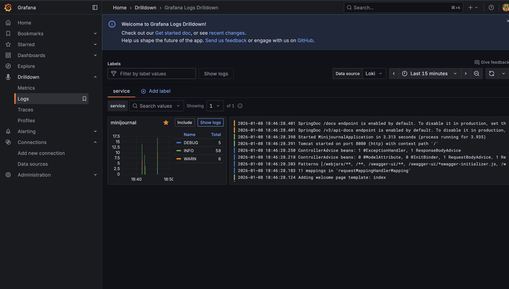
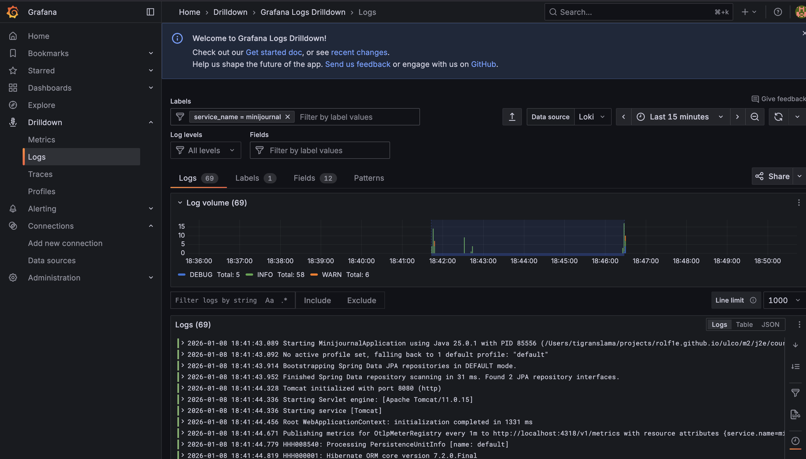
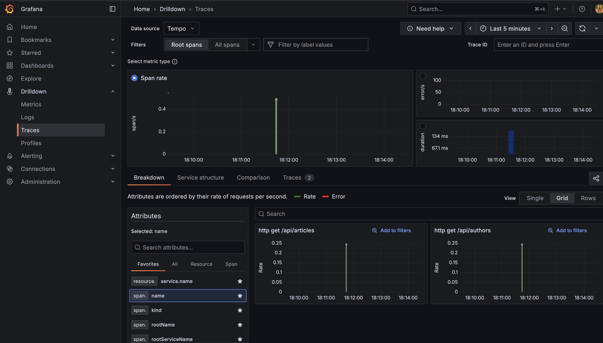
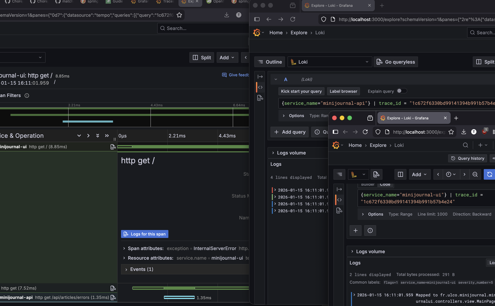
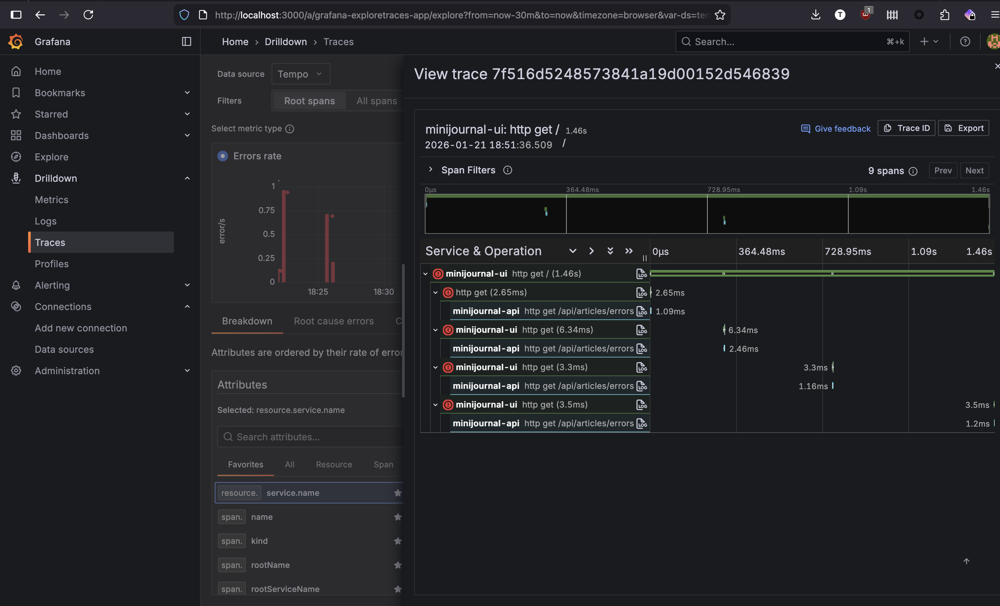

# OpenTelemetry avec Spring Boot

## Qu'est-ce OpenTelemetry?

OpenTelemetry est une suite d'outils permettant d'effectuer ce que l'on appelle "observability". C'est la capacité à
pouvoir comprendre ce qu'il se passe sure notre système d'informations à tout moment. On peut ainsi facilement lire les
logs, debug, retracer les appels, etc. C'est un nécessité dans les architectures distribuées modernes car il y a
beaucoup trop de traffic pour réussir à scroll et debug manuellement.

## Grafana

D'abord, il nous faut un outil de visualisation. Grafana est un outil open-source très populaire pour cela. Il permet de
créer des dashboards personnalisés et de se connecter à de nombreuses sources de données. Ici, nous allons utiliser une
image docker fournie par Grafana qui intègre OpenTelemetry Collector et Loki pour la collecte et la visualisation des
métriques et des logs.

```dockerfile
services:
    grafana:
        image: 'grafana/otel-lgtm:0.11.10'
        ports:
          - '3000:3000' # UI, credentials: admin / admin
          - '4318:4318' # OTel collector HTTP port
```

## Implementation

Ensuite, il faut dire à SpringBoot d'utiliser OpenTelemetry. Pour cela, il suffit d'ajouter la dépendance suivante.

Éditer le fichier `build.gradle`, ajouter les dépendances suivantes.

```groovy
implementation 'org.springframework.boot:spring-boot-starter-opentelemetry'
implementation 'io.opentelemetry.instrumentation:opentelemetry-logback-appender-1.0:2.21.0-alpha'
implementation 'net.logstash.logback:logstash-logback-encoder:7.4'
```

Dans le fichier `src/main/resources/application.properties`, ajouter la configuration suivante.

```properties
management.otlp.metrics.export.url=http://localhost:4318/v1/metrics
```

Maintenant que tout est en place, il est temps de jouer un peu avec OpenTelemetry.
Lancez votre application Spring Boot et accédez à Grafana à l'adresse `http://localhost:3000`.
Utilisez les identifiants par défaut `admin` / `admin` pour vous connecter. Une fois connecté, vous pouvez aller dans
l'onglet "Drilldown" pour voir les métriques de votre application.

Vous pouvez voir l'onglet "Metrics" par défaut avec les métriques votre application et de la JVM.

### Logs

Ajoutons des logs à OpenTelemetry !

Dans le fichier `src/main/resources/application.properties`, ajouter la configuration suivante.

```properties
management.opentelemetry.logging.export.otlp.endpoint=http://localhost:4318/v1/logs
```

Modifier `src/main/resources/logback-spring.xml`, ajouter la configuration suivante pour envoyer des logs au format JSON
à OpenTelemetry.

```xml
<?xml version="1.0" encoding="UTF-8"?>
<configuration>
    <include resource="org/springframework/boot/logging/logback/base.xml"/>

    <appender name="OTEL" class="io.opentelemetry.instrumentation.logback.appender.v1_0.OpenTelemetryAppender">
        <encoder class="net.logstash.logback.encoder.LoggingEventCompositeJsonEncoder">
            <providers>
                <timestamp>
                    <fieldName>timestamp</fieldName>
                </timestamp>
                <pattern>
                    <pattern>
                        {
                        "level": "%level",
                        "logger": "%logger",
                        "thread": "%thread",
                        "message": "%message",
                        "exception": "%exception"
                        }
                    </pattern>
                </pattern>
            </providers>
        </encoder>
    </appender>


    <root level="INFO">
        <appender-ref ref="CONSOLE"/>
        <appender-ref ref="OTEL"/>
    </root>

</configuration>
```

Il faut ensuite ajouter une classe de configuration pour OpenTelemetry.

```java
package fr.ulco.minijournal.configurations;

import io.opentelemetry.api.OpenTelemetry;
import io.opentelemetry.instrumentation.logback.appender.v1_0.OpenTelemetryAppender;
import lombok.RequiredArgsConstructor;
import org.springframework.beans.factory.InitializingBean;
import org.springframework.stereotype.Component;

@Component
@RequiredArgsConstructor
public class InstallOpenTelemetryAppender implements InitializingBean {

    private final OpenTelemetry openTelemetry;

    @Override
    public void afterPropertiesSet() {
        OpenTelemetryAppender.install(this.openTelemetry);
    }

}
```

Et voilà ! Vos logs sont maintenant envoyés à OpenTelemetry et vous pouvez les visualiser dans Grafana.

D'abord une vue générale par service


En appuyant sur "Show logs" vous pouvez voir une vue plus complète


### Traces

#### Mise en place

Pour activer les traces dans OpenTelemetry, ajouter la configuration suivante dans le fichier
`src/main/resources/application.properties`.

```properties
management.opentelemetry.tracing.export.otlp.endpoint=http://localhost:4318/v1/traces
management.tracing.sampling.probability='1.0'
```



Vous pouvez cliquer sur une trace pour voir les détails. Vous devriez en voir pour chaque service que vous avez
configuré.

#### Debug avec les traces

Attention, la suite ce base sur le projet `minijournal`.

Nous allons jouer un peu avec ce module, afin de voir comment debug avec les traces.
Pour cela, nous allons ajouter un endpoint qui retourne de temps en temps une erreur sur un appel HTTP.
L'ojectif est de la voir apparaître dans notre UI. Puis ensuite, on ajoute un mécanisme de try pour que fix Spring
l'auto fix.

/!\ Quand vous utilisez des RestClient ou RestTemplate, il faut s'assurer qu'ils proviennent du contexte Spring. En
effet, celui-ci ajouetera authematiquement les traces ID afin qu'ils soient dans le même contexte et donc tracable dans
Grafana.

Par exemple, dans `MiniJournalApiConfig.java`, on se base sur le `RestClient.Builder` fourni par Spring.

```java

@Configuration
public class MiniJournalApiConfig {

    @Bean
    public RestClient restClient(RestClient.Builder builder) {
        return builder
                .baseUrl("http://localhost:8080")
                .build();
    }

}
```

On peut ensuite, trouver une trace dans l'UI (en clickant sur le petit bouton "log") et la trouver à travers les
différentes applications.

Vous pouvez également utiliser `@SpanTag` pour ajouter des tags personnalisés à vos spans.



Ajouter maintenant un mécanisme de retry dans l'UI endpoint.

### Spring retry

Il faut ajouter ceci sur notre class Main `@EnableResilientMethods` afin d'actover la résilience.
Maintenant, on peut ajouter un mécanisme de retry sur notre appel HTTP.

```java

@Retryable(includes = RestClientException.class, delayString = "300ms", maxRetries = 3, multiplier = 1.5)
public ResponseEntity<Collection<ArticleSummaryDO>> fetchArticles() {
    return api.get()
            .uri(Routes.GET_ARTICLES_ENDPOINT)
            .retrieve()
            .toEntity(new ParameterizedTypeReference<>() {
            });
}
```

Maintenant, lorsque vous appelez cet endpoint, vous devriez voir les retries dans les traces Grafana.


### Metrics

Vous pouvez ajouter des métriques personnalisées dans votre application Spring Boot en utilisant l'API OpenTelemetry.

Activer metrics annotations et export dans le fichier `src/main/resources/application.properties`.

```
management.observations.annotations.enabled: true
management.otlp.metrics.export.step: 10s
```

`@Counted` sur un endpoint pour compter le nombre d'appels.

```java

@Counted(value = "minijournal_api_articles_with_error_fetch_count", description = "Number of times articles with error endpoint was called")
@GetMapping("/errors")
public ResponseEntity<Collection<ArticleSummaryDTO>> getArticlesWithError(
        @RequestParam(required = false) Collection<String> authorNames
) {
    // code
}
```

Lancer quelques appels sur cet endpoint, puis aller dans Grafana pour voir la métrique.

## Resources

- https://github.com/bclozel/matchmaking/tree/main

OpenTelemetry

- https://spring.io/blog/2025/11/18/opentelemetry-with-spring-boot
- https://opentelemetry.io/docs/zero-code/java/agent/getting-started/
- https://docs.spring.io/spring-boot/reference/actuator/observability.html
- https://opentelemetry.io/docs/zero-code/java/spring-boot-starter/

Spring retry

- https://docs.spring.io/spring-framework/reference/core/resilience.html - utile pour ce tutoriel
- https://www.baeldung.com/spring-retry - utile pour la culture

