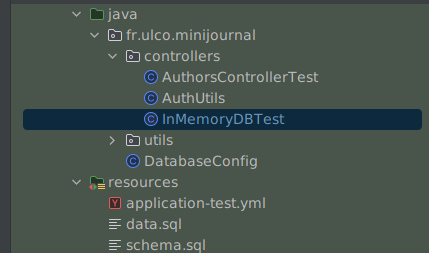

### Spring tests

Pour effectuer des tests d'intégration, Spring propose une suite d'outils permettant de manipuler le `Context`.

Il nous faut ces dépendances:

```groovy
testImplementation 'org.springframework.boot:spring-boot-starter-restclient-test'
testImplementation 'org.springframework.boot:spring-boot-starter-webmvc-test'
testRuntimeOnly 'org.junit.platform:junit-platform-launcher'
```

// TODO
```xml 

<dependencies>
    <!-- SPRING TEST -->
    <dependency>
        <groupId>org.springframework.boot</groupId>
        <artifactId>spring-boot-starter-test</artifactId>
        <scope>test</scope>
    </dependency>

    <dependency>
        <groupId>org.springframework.security</groupId>
        <artifactId>spring-security-test</artifactId>
    </dependency>

    <dependency>
        <groupId>com.h2database</groupId>
        <artifactId>h2</artifactId>
        <version>2.1.214</version>
        <scope>test</scope>
    </dependency>

    <dependency>
        <groupId>junit</groupId>
        <artifactId>junit</artifactId>
        <scope>test</scope>
    </dependency>
</dependencies>
```

L'annotation `@TestConfiguration` permet de définir une configuration disponible seulement dans les tests.

Ci-dessous un exemple pour effectuer un appel REST sur notre endpoint `/authors`. Ici, est utilisé la classe `MockMvc`,
qui permet d'interagir avec les endpoints.

Pour rendre le test plus facile, la couche de la base de données est `mocked` (émulée) via une librairie Mockito.

Il est possible d'avoir une base de données en mémoire pour effectuer des tests e2e. La base H2 est un bon candidat pour
ce genre de besoins !

```java

@SpringBootTest
@AutoConfigureMockMvc
@RunWith(SpringRunner.class)
public class AuthorsControllerTest {

    @Autowired
    private MockMvc mvc;

    @Mock
    private AuthorRepository authorRepository;

    @InjectMocks
    private AuthorController controller;


    @Test
    public void shouldFindAuthors() throws Exception {
        final var tigran = new AuthorEntity();
        tigran.setName("Tigran");

        final var arthur = new AuthorEntity();
        arthur.setName("Arthur");
        when(authorRepository.findAll())
                .thenReturn(Arrays.asList(tigran, arthur));


        final var basicPayload = Base64.getEncoder()
                .encodeToString("admin:admin".getBytes(StandardCharsets.UTF_8));
        final var request = MockMvcRequestBuilders.get("/authors")
                .header("Authorization", "Basic " + basicPayload);
        mvc.perform(request)
                .andExpect(status().is2xxSuccessful())
                .andExpect(content().json("[\"Tigran\", \"Arthur\"]"));

    }
}
```

Notez l'utilisation de l'annotation `@SpringBootTest`. Celle-ci démarre une application entière. Mais il est possible de
lancer seulement certains modules en fonction des besoins. Avec par exemple `@DataJpaTest` pour la couche de
données. `@WebMvcTest` pour les controllers et services.

Les assertions sont faites avec `Junit` via l'API `jupiter.Assertions` ou alors Spring dans le cas du mvc (
MockMvcRequestBuilders API).

[Baeldung tutorial](https://www.baeldung.com/spring-boot-testing)

#### Clean e2e tests with h2 database

D'abord les configurations, il nous faut d'abord configurer la `DataSource` pour que Spring puisse l'instancier.

```yaml
spring:
  jpa:
    show-sql: true
  datasource:
    driver-class-name: org.h2.Driver
    url: jdbc:h2:mem:db;DB_CLOSE_DELAY=-1
    username: sa
    password: sa
  hibernate:
    ddl-auto: none
  sql:
    init:
      mode: embedded
```

Nous sommes également capable de gérer le schéma de notre base de données et de l'initialiser avec des données.



Ensuite, il faut créer les `Bean`s nécessaires:

```java

@TestConfiguration
@EnableJpaRepositories(basePackages = "fr.ulco.minijournal.model.dao")
// packages where Spring is looking for our Repositories
@TestPropertySource(locations = "classpath:./application-test.yml") // Config of the data source
@EnableTransactionManagement
public class DatabaseConfig {

    @Autowired
    private Environment env;

    @Bean
    public DataSource dataSource() {
        final var dataSource = new DriverManagerDataSource();

        dataSource.setDriverClassName(env.getProperty("spring.datasource.driver-class-name"));
        dataSource.setUrl(env.getProperty("spring.datasource.url"));
        dataSource.setUsername(env.getProperty("spring.datasource.username"));
        dataSource.setPassword(env.getProperty("spring.datasource.password"));

        return dataSource;
    }
}
```

Enfin, nous pouvons attaquer notre test. Il faut bien veiller à indiquer à Spring notre classe de configurations. Ainsi
que lui demander d'utiliser le profil "test", sinon il va se lancer avec le profil par défaut et n'utilisera pas le
fichier `application-test.yml`.

```java

@ActiveProfiles("test")
@SpringBootTest
@AutoConfigureMockMvc
@ContextConfiguration(classes = {DatabaseConfig.class})
@RunWith(SpringRunner.class)
public class InMemoryDBTest {

    @Autowired
    private MockMvc mvc;

    private final ObjectMapper mapper = new ObjectMapper();

    @Order(1)
    @Test
    public void shouldCreateNewAuthor() throws Exception {
        final var content = new NewAuthorDTO("Michel");

        final var request = MockMvcRequestBuilders.post(Routes.CREATE_AUTHOR)
                .contentType(MediaType.APPLICATION_JSON)
                .content(mapper.writeValueAsString(content))
                .header("Authorization", "Basic " + AuthUtils.basicPayload);

        mvc.perform(request)
                .andExpect(status().isCreated())
                .andExpect(header().exists("Location"));
    }

    @Order(2)
    @Test
    public void shouldFindNewCreatedUser() throws Exception {
        final var request = MockMvcRequestBuilders.get(Routes.GET_AUTHORS_DETAILS.replace("{id}", "3"))
                .contentType(MediaType.APPLICATION_JSON)
                .header("Authorization", "Basic " + AuthUtils.basicPayload);

        mvc.perform(request)
                .andExpect(status().isOk())
                .andExpect(content().json("{\"name\": \"Michel\"}"));
    }

}

```
