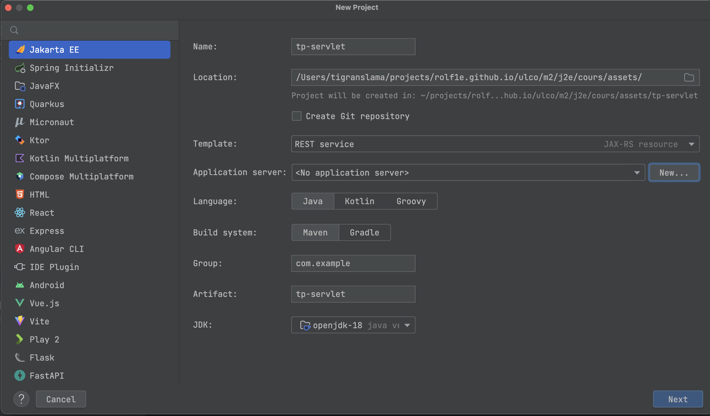
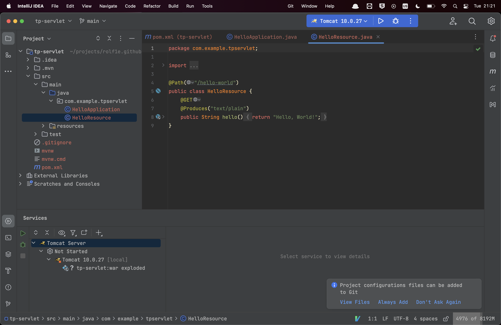

# TP WebServlet

## Le setup

- Intellij IDEA
- JDK 11+
- [Serveur tomcat 10](https://tomcat.apache.org/download-10.cgi)

## Étapes

### 1.

Télécharger et unzip un serveur tomcat 10.

### 2.

Dans Intellij créer un nouveau projet Jakarta EE
vide. 
Dans le champ `Application server` préciser le chemin vers le dossier du server tomcat téléchargé en appuyant
sur `New...`. Valider le formulaire suivant en choisissant la version JEE 10. Vous obtenez au
final 

### 3.

Lancer le server tomcat, ouvrez le lien suivant dans votre
navigateur `http://localhost:8080/TpServlet_war_exploded/api/hello-world`.
Vous y trouverez une page blanche avec `Hello World !`.

Note: Si vous obtenez `permission denied` en lançant le serveur. Executer `chmod a+x *.sh` dans le dossier `bin` du
server tomcat.

Ci-dessous une manière ancienne de créer une servlet.

```java
import jakarta.servlet.*;
import jakarta.servlet.http.*;
import jakarta.servlet.annotation.*;

import java.io.IOException;

@WebServlet(name = "HelloWorld", value = "/HelloWorld")
public class HelloWorld extends HttpServlet {
    @Override
    protected void doGet(HttpServletRequest request, HttpServletResponse response) throws ServletException, IOException {
        response.getWriter().append("Hello World !");
    }

    @Override
    protected void doPost(HttpServletRequest request, HttpServletResponse response) throws ServletException, IOException {

    }
}
```

Démarrer le serveur tomcat et se rendre sur ce lien `http://localhost:8080/tp_servlet_war_exploded/HelloWorld`. Vous
devriez voir une page blanche avec `Hello World !`.

### 4.

Pour la suite du tp nous allons réaliser un petit scraper de reddit.
Pour le moment nous n'utiliserons pas de base de données. Simplement dans la couche DAO, nous renverrons des listes
hardcodées de notre donnée.

Vous pouvez utiliser ce lien pour obtenir `https://www.reddit.com/r/{sub-reddit}/new.json` des posts
et `https://www.reddit.com/r/{sub-reddit}/about.json` pour obtenir les détails du sub reddit.
Par exemple pour le subreddit [/r/scala](https://www.reddit.com/r/scala/new.json).

Vous pouvez soit réaliser une petite UI en JS natif pour afficher du JSON retourné par vos endpoints en Java, ou bien
retourner du HTML/CSS dans vos endpoints.

Pour trois sub reddit afficher:

- Le nom du sub reddit
- La description
- Trois articles de ce sub

Un petit dump de la source de données:

#### Table des Subs Reddit

| id  | name   | description                                                                                                    |
|-----|--------|----------------------------------------------------------------------------------------------------------------|
| 1   | Java   | Java News/Tech/Discussion/etc. No programming help, no learning Java                                           |
| 2   | Scala  | Welcome to Scala                                                                                               |
| 3   | Kotlin | Discussion about Kotlin, a statically typed programming language for the JVM, Android, JavaScript, and native. |

#### Table des Posts

| id  | sub     | auteur    | texte                                                                                                                                                                                                                                                                                                                                     |
|-----|---------|-----------|-------------------------------------------------------------------------------------------------------------------------------------------------------------------------------------------------------------------------------------------------------------------------------------------------------------------------------------------|
| 1   | r/Scala | Redditor1 | Hi, I am new to scala. I have built a fat jar.i have added a jks file.\nwhile running locally i am able to use the jks but when i am building a jar and running it..i am getting an error that jks file path is not found....\nwhere and how should i put my jks file in code in intellij so that the jks file can be accessed by my jar? |
| 2   | r/Java  | Redditor1 | My attempt to understand…erceive Java as complex                                                                                                                                                                                                                                                                                          | 
| 3   | r/Scala | Redditor2 | "I see many videos on YouTube teaching how to use scala, and I get the impression that every dev teaching scala knows Java."                                                                                                                                                                                                              |
| 4   | r/Java  | Redditor3 | Are Long better than Integer as keys for a Map?                                                                                                                                                                                                                                                                                           |
| 5   | r/Scala | Redditor4 | Scala community now has control over the official Scala grammar for tree-sitter !                                                                                                                                                                                                                                                         |
| 6   | r/Scala | Redditor5 | What is ArrayDeque  Kotlin Deque?                                                                                                                                                                                                                                                                                                         |

Un example pour retourner du JSON sur un endpoint `http://localhost:8080/TpServlet_war_exploded/api/example`

```java

@Path("/example")
public class Example {
    static class Test {
        String a;
        Integer b;

        public Test(String hello, int i) {
            this.a = hello;
            this.b = i;
        }

        public String getA() {
            return a;
        }

        public Integer getB() {
            return b;
        }
    }


    @GET
    @Produces("application/json")
    public Test pair() {
        return new Test("Hello", 1);
    }

}
```

### 5. Pour aller plus loin !

Si vous êtes en avance et **motivé**, vous pouvez automatiser la manière dont la donnée est entrée avec un appel HTTP
sur les liens donnés plus haut !

Pour cela vous pouvez utiliser les [fonctions natives de Java](https://www.baeldung.com/java-http-request) pour faire un
appel HTTP.

## Sources

[Jetbrains tutorial](https://www.jetbrains.com/idea/guide/tutorials/working-with-apache-tomcat/)
[Le TP de Max Devulder](https://gitlab.com/ulco-jee/javaquarium/-/wikis/sujet%20TP)
